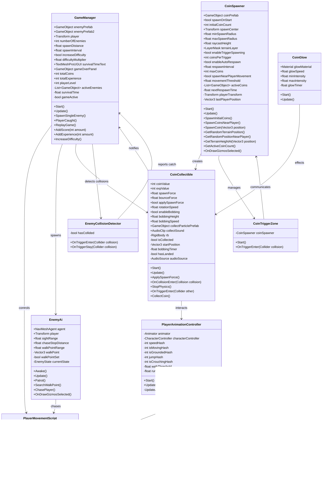

# Class UML Diagram - Game Implementation

## Class Diagram with Details

---

## Inheritance & Relationships

```mermaid
graph TD
    MonoBehaviour["MonoBehaviour<br/>(Unity Base)"]

    GameManager_C["GameManager"]
    PlayerMovement["PlayerMovementScript"]
    EnemyAI_C["EnemyAi"]
    CoinCollectible_C["CoinCollectible"]
    CoinSpawner_C["CoinSpawner"]
    PlayerAnimation["PlayerAnimationController"]
    EnemyCollision["EnemyCollisionDetector"]
    CoinTrigger["CoinTriggerZone"]
    CoinGlow_C["CoinGlow"]

    MonoBehaviour --> GameManager_C
    MonoBehaviour --> PlayerMovement
    MonoBehaviour --> EnemyAI_C
    MonoBehaviour --> CoinCollectible_C
    MonoBehaviour --> CoinSpawner_C
    MonoBehaviour --> PlayerAnimation
    MonoBehaviour --> EnemyCollision
    MonoBehaviour --> CoinTrigger
    MonoBehaviour --> CoinGlow_C

    style MonoBehaviour fill:#FFE4B5
    style GameManager_C fill:#FF6B6B
    style PlayerMovement fill:#4ECDC4
    style EnemyAI_C fill:#95E1D3
    style CoinCollectible_C fill:#FFD93D
    style CoinSpawner_C fill:#FFD93D
    style PlayerAnimation fill:#C7B7D4
    style EnemyCollision fill:#A8DADC
    style CoinTrigger fill:#A8DADC
    style CoinGlow_C fill:#FFE66D
```

---

## Script Descriptions

### **GameManager** (Core Game Controller)

- Manages overall game state
- Spawns enemies with progressive difficulty
- Tracks player survival time
- Handles coin and XP system
- Detects game over condition
- Manages UI updates

### **PlayerMovementScript** (Player Control)

- Handles WASD movement input
- Camera look control with mouse
- Jump and crouch mechanics
- CharacterController integration

### **EnemyAi** (Enemy Behavior)

- NavMesh-based AI movement
- Constant player chasing (no sight limit)
- Patrol pattern when not chasing
- Collision detection for catch

### **CoinCollectible** (Coin Object)

- Physics-based coin spawning
- Rotation and bobbing animations
- Collision and trigger detection
- Score and XP awarding
- Particle effects on collection

### **CoinSpawner** (Coin Management)

- Initial coin spawning
- Dynamic respawning system
- Player-following spawn logic
- Trigger-based spawning
- Terrain detection via raycasting

### **PlayerAnimationController** (Animation)

- Animation parameter management
- Movement state detection
- Speed-based animation blending
- Jump animation triggering

### **EnemyCollisionDetector** (Collision Handler)

- Detects player capture
- Triggers game over
- Notifies GameManager

### **CoinTriggerZone** (Bonus Spawning)

- Triggers bonus coin spawns
- Zone-based activation

### **CoinGlow** (Visual Effect)

- Coin glowing animation
- Pulsing intensity effect
